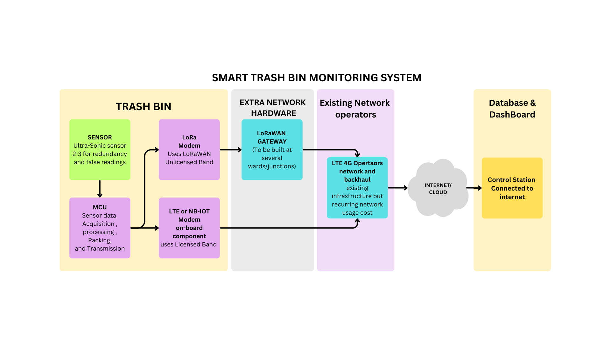
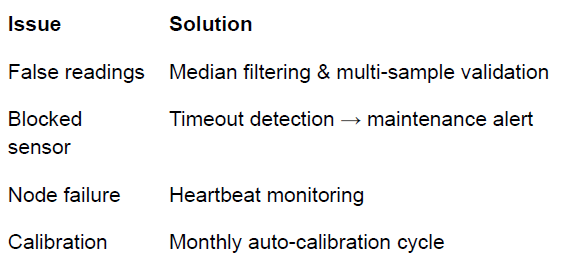
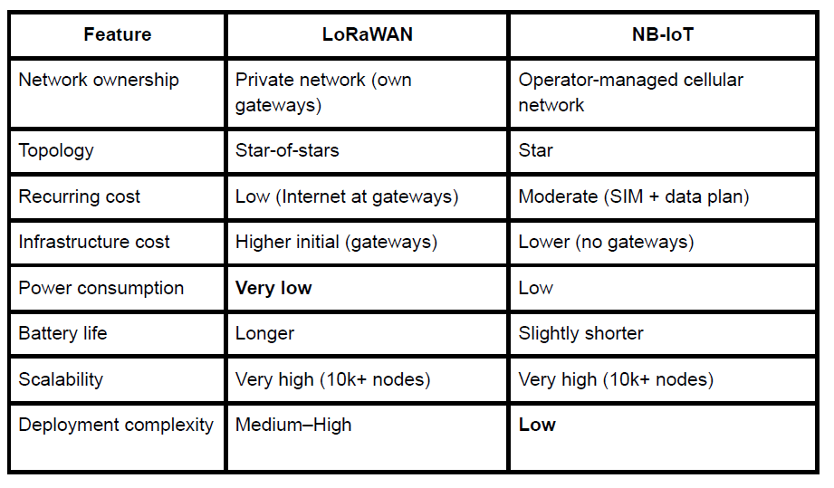

# Trash-management-system-IOt-solution
## 1. Introduction & Problem Context

Ineffective collection schedules are a common problem for urban garbage management
systems. Increased operating expenses, traffic congestion, and poor urban cleanliness are the
results of some waste containers overflowing before collection and others being emptied too
soon.
In order to ensure timely collection with the least amount of resource consumption, this project
suggests a Smart IoT-enabled Waste Bin Network that continuously checks bin fill levels and
dynamically optimizes garbage truck routes throughout city zones.

## 2. Suggested System Architecture

**2.1 Overview of the System**
The system uses a mixed communication architecture and is intended for widespread city
deployment (10,000 bins throughout Hyderabad):
NB-IoT for crucial areas and pilot zones
LoRaWAN for extensive, low-cost urban deployment
**2.2 Each Trash Bin's Hardware**

● Sensor for Fill Level- The Ultrasonic Sensor-Reliable, inexpensive distance
measurement

● Microcontroller- STM32/ESP32 as Flexible, low-power peripherals

● Connectivity- LoRa radio or NB-IoT modem- Long-range coverage at the city level

● Strength- Li-ion battery plus a tiny solar panel permits operation for several months

● Outdoor IP-rated casingWeather and tamper resistance

**Note** : LORAWAN based system requires extra hardware which act as network gateways for
several bins to connect and send data to control stations.

The network architecture to be chosen is **stars of star** topology where each bin is not
constrained to one gateway node but to several gateways present in its range and differentiated
based on the Bin ID.

Each LoRaWAN gateway
Would be connected back to the internet using 4G LTE or 5G network to the internet using the
standard modems available in the market.

The following proposed system involves two methods for network connectivity-

1. NB-IOT network
2. LoRaWAN network

## 3. Design and Protocols for Data Flow

**3.1 Data Flow:**

Sensor → MCU → Communication Module → Network → Cloud → Database → Dashboard →
Optimization Engine

**3.2 Protocols for Communication:**
MQTT Scalable, low-power, and lightweight → Cloud

Cloud → Dashboard REST/HTTP Simple alerts for integration Webhooks and Push Real-time
alerts

**3.2 Data Packing:**

Use Ward number for bin identification, city block number and assign ID for areas like
Indranagar(eg. ID- 21), 4th block, 3rd ward, 1st main, bin number 2- data packet format-
**2104030102** : **Area code, block, ward, main, bin id.**

Gateways will not have explicit addressing for identification as they would be unnecessary.

## 4. Strategy for Route Optimization

**4.1 Rules for Making Decisions**

● Bin full ≥ 80% is a high priority.

● 60–80% is the medium priority.

● Low Priority: less than 60%

**4.2 Algorithm for Optimization**

● Sort high-priority containers.

● Zone-based clustering.

● Create truck routes that are optimum and assign tasks to trucks based on density of bins
to be collected.

## 5. Power Management Strategy MethodAn explanation

● MCU takes deep naps in between measurements.

● The number of measurements and transmission will be 2-3 times per day.

● Transmission Driven by EventsOnly threshold or daily report data is sent using data

analytics for prediction based frequency of operation from control station.

● Radio Modes with Low Power LoRa sleep modes and NB-IoT PSM.

● Battery life is extended via solar charging.

● Including MOSFET for cutting off and powering on the transmitter modem only when
needed.

## 6. Reliability & Fault Handling

**Issue Solution**

● False readings Median filtering & multi-sample validation

● Blocked sensor Timeout detection → maintenance alert

● Node failure Heartbeat monitoring

● Calibration Monthly auto-calibration cycle

## 7. Network Design Topology and Scalability

● NB-IoT star topology- Need for designing the network topology and maintenance is
negligible as it is maintained by mobile network services.

● LoRaWAN star-of-stars topology, high networking cost and complexity of building and
maintaining.

● By dispersing entrances and zoning the city, the design accommodates more than 1,
bins.

## 8. Cost & Feasibility Analysis

● The upfront cost of both systems is high but the recurring cost of NB-IOT cannot
ignored- the cost of network paid to the network provider.

● NB-IOT Network- Yearly network plans can be helpful as they provide cheaper plans for
low data consumption and zero talk-time.

● LoRaWAN will have initial hardware cost for network gateways at each ward and again
connecting to the internet would be coming to the same cost. But LoRa systems can
have longer battery life.

## 9. Conclusion

